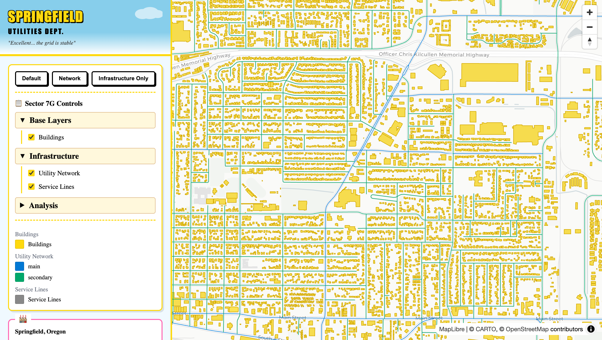

# Springfield Utilities

*"Mmm... infrastructure"* - Homer Simpson

A geospatial starter template featuring synthetic utility network visualization for Springfield, Oregon (yes, *that* Springfield). Built with PostGIS, pgRouting, and a Simpsons-themed UI complete with rotating quotes and Mr. Burns safety disclaimers.



## What's Inside

| Dataset | Count | Source |
|---------|-------|--------|
| Buildings | ~19,759 | OpenStreetMap (Simpsons yellow) |
| Utility Pipes | ~1,314 | Synthesized from OSM roads |
| Service Lines | ~17,056 | KNN connections to buildings |
| Graph Edges | ~1,317 | pgRouting topology |

**Demo features:**
- Click any building to trace connected utility network (pgRouting graph traversal)
- Toggle layers: buildings, main pipes (blue), secondary pipes (green), service lines
- Layer presets: Default, Network View, Infrastructure Only
- Rotating Simpsons quotes in the header

## Quick Start

```bash
./deploy.sh    # Start all services
./test.sh      # Run 184 tests
```

Open http://localhost:8080 - you'll see Springfield, Oregon with the utility network overlay.

## Stack

| Layer | Technology | Purpose |
|-------|------------|---------|
| Database | PostgreSQL 16 + PostGIS 3.5 + pgRouting 3.6 | Spatial data & graph analysis |
| Tile Server | Martin | MVT vector tiles |
| Backend | FastAPI | REST API & graph queries |
| Frontend | Next.js 14 + Deck.gl | React UI with WebGL map |
| Proxy | nginx | Routing & caching |

## Project Structure

```
├── scripts/                # Synthetic data tooling
│   ├── load-osm.sh        # Download OSM data for bbox
│   └── generate-network.py # Synthesize utility network
├── config/
│   └── synth-params.yaml  # Demo area configuration
├── backend/               # FastAPI application
├── frontend/              # Next.js application
├── db/migrations/         # SQL migrations (idempotent)
└── docker-compose.yml
```

## Synthetic Data Pipeline

The demo data is generated from OpenStreetMap:

```bash
# 1. Load OSM buildings and roads
./scripts/load-osm.sh

# 2. Generate synthetic utility network
python scripts/generate-network.py

# 3. Restart services
./deploy.sh --fast
```

Configuration in `config/synth-params.yaml`:
- Bounding box for demo area
- Road class → pipe type mappings
- Materials, diameters, install year ranges
- Service line max distance

## API Endpoints

| Path | Description |
|------|-------------|
| `/` | Springfield Utilities UI |
| `/api/docs` | FastAPI OpenAPI docs |
| `/api/graph/nearest_edge?lon=&lat=` | Find nearest pipe to point |
| `/api/graph/nearby_edges/{id}?hops=` | Get connected edges within N hops |
| `/tiles/osm_buildings_mvt/{z}/{x}/{y}` | Building footprints |
| `/tiles/synth_pipes_mvt/{z}/{x}/{y}` | Utility pipes |
| `/tiles/synth_services_mvt/{z}/{x}/{y}` | Service connections |

## Testing

184 tests across all layers:

```bash
./test.sh              # Run all tests
./test.sh backend      # pytest (79 tests)
./test.sh frontend     # Vitest (80 tests)
./test.sh e2e          # Playwright (25 tests)
```

## Using as a Template

To adapt for your own project:

1. **Change demo area** - Edit `config/synth-params.yaml` with your bbox
2. **Regenerate data** - Run `./scripts/load-osm.sh` and `generate-network.py`
3. **Update view** - Change initial coordinates in `PropertyMap.tsx`
4. **Customize layers** - Edit `frontend/src/config/layers.json`
5. **Remove the whimsy** - Or don't, Mr. Burns approves either way

## Domain Model

The synthetic network uses these tables:

| Schema | Table | Description |
|--------|-------|-------------|
| `osm` | `buildings` | OSM building footprints |
| `osm` | `roads` | OSM road geometries |
| `synth` | `pipes` | Utility pipes (from roads) |
| `synth` | `services` | Building-to-pipe connections |
| `synth` | `graph_edges` | pgRouting topology |
| `synth` | `graph_nodes` | Network vertices |

Legacy tables (`properties`, `property_types`, `inspections`) exist for backwards compatibility but aren't used in the UI.

## Useful Commands

```bash
# Database access
docker compose exec postgres psql -U app -d app

# View Martin tile catalog
curl http://localhost:8080/tiles/catalog

# Rebuild single service
docker compose up -d --build frontend

# Reset everything
docker compose down -v && ./deploy.sh
```

## Documentation

- [Architecture Overview](docs/ARCHITECTURE.md)
- [Feature Flags](docs/FEATURE_FLAGS.md)
- [Architecture Decision Records](docs/adr/)

---

*Safety codes not actually verified. Mr. Burns declined comment.*
